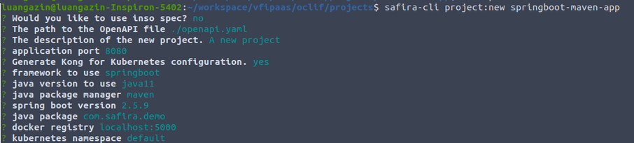
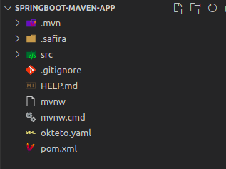
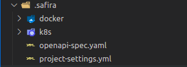
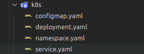
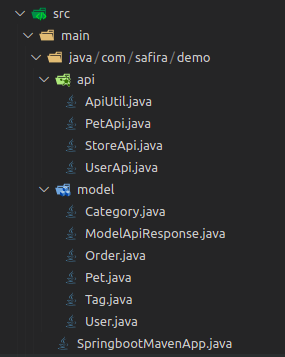
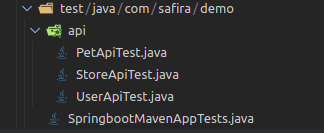

# Safira CLI

Nós simplificamos a complexidade no processo de construção de suas APIs, facilitando a criação de ambiente de desenvolvimento com agilidade, performance e escalabilidade, aumentando a produtividade e melhorando a experiência dos desenvolvedores.

### As principais vantagens da aplicação do safira-cli

- Geração de templates de projetos Java **[SpringBoot](https://spring.io/)** e **[Quarkus](https://quarkus.io/)**
- Arquivos de configuração do **[Kubernetes](https://kubernetes.io/pt-br/)** e **[Docker](https://www.docker.com/)** File
- Gerar mapeamento de endpoints e plugins para o **[Kong](https://konghq.com/)** via **[Insommia](https://insomnia.rest/download)**
- Disponibiliza o runTime do **[Okteto](https://okteto.com/)**

- Deploy automatizado usando **[ArgoCD](https://argo-cd.readthedocs.io/en/stable/)**

## Pré-Requisitos

  - **[docker](https://docs.docker.com/engine/install/)**

  - **[Node_gyp](https://www.npmjs.com/package/node-gyp)**

  - **[python_v3.6+](https://www.python.org/downloads/)**

  - **[nodejs14+](https://nodejs.org/en/download/)**

  - **[make](https://www.gnu.org/software/make/)**

  - **[g++](http://www.qnx.com/developers/docs/6.5.0SP1.update/com.qnx.doc.neutrino_utilities/g/gxx.html)**

  - **[jq](https://stedolan.github.io/jq/download/)**

  - **[curl](https://curl.se/download.html)**

  - **[java8+](https://www.java.com/pt-BR/download/manual.jsp)**

  - **[maven](https://maven.apache.org/download.cgi)**

## Instalação Safira-CLI

Comando para instalação global:

```bash
npm install -g @vfipaas/safira-cli
```

Ver a versão do safira-cli:

```bash
safira-cli (-v|--version|version)
```

Criar um projeto Safira-CLI:

Comando para criação do projeto:

```bash
safira-cli project:new [PROJECT-NAME]

```
Criar o projeto dentro de uma pasta já existente:

```bash
safira-cli project:new .

```
Comandos para utilização:

```bash
  safira-cli project:new [PROJECT-NAME]

ARGUMENTS
  PROJECT-NAME  name of the project

OPTIONS
  -f, --framework=(springboot|quarkus)
  -h, --help                                 show CLI help
  -i, --openapi-inso-path=openapi-inso-path  Import OpenAPI file from the INSO Workspace.
  -l, --language=java                        Programming language to use
  -o, --openapi-file-path=openapi-file-path  The path to the OpenAPI file.
  --application-port=8080                    Application port
  --docker-registry=localhost:5000           Docker registry
  --inso-spec-name=inso-spec-name            The name of the INSO specification.
  --java-pack-manager=(gradle|maven)         Java package management
  --java-package=com.safira.demo             Java package
  --java-springboot-version=2.5.9            Springboot version
  --kong-kubernetes=yes|no                   Generate Kong for Kubernetes configuration
  --kubernetes-namespace=default             Kubernetes namespace
  --new-project-root=new-project-root        The path where new projects will be created, relative to the new workspace root.
  --project-description=project-description  The description of the new project.

EXAMPLES
  safira-cli project:new
  safira-cli project:new app-name
  safira-cli project:new app-name --language java11 --java-pack-manager gradle --application-port 8090
  safira-cli project:new .  -create a project in the current folder
```
### Como utilizar o Safira-CLI 

Agora você pode acessar alguns comandos principais que irá te ajudar em sua utilização:

```bash

  $ safira-cli commands

OPTIONS
  -h, --help              show CLI help
  -j, --json              display unfiltered api data in json format
  -x, --extended          show extra columns
  --columns=columns       only show provided columns (comma-separated)
  --csv                   output is csv format [alias: --output=csv]
  --filter=filter         filter property by partial string matching, ex: name=foo
  --hidden                show hidden commands
  --no-header             hide table header from output
  --no-truncate           do not truncate output to fit screen
  --output=csv|json|yaml  output in a more machine friendly format
  --sort=sort             property to sort by (prepend '-' for descending)
```

### Help

```bash
safira-cli help [COMMAND]
```

Formas de utilização:
```bash
USAGE
  $ safira-cli help [COMMAND]

ARGUMENTS
  COMMAND  command to show help for

OPTIONS
  --all  see all commands in CLI

```
### AutoComplete

```bash 
safira-cli autocomplete [SHELL]
```
Formas de utilização:

```bash 
USAGE
  $ safira-cli autocomplete [SHELL]

ARGUMENTS
  SHELL  shell type

OPTIONS
  -r, --refresh-cache  Refresh cache (ignores displaying instructions)

EXAMPLES
  $ safira-cli autocomplete
  $ safira-cli autocomplete bash
  $ safira-cli autocomplete zsh
  $ safira-cli autocompNODE
  $ safira-cli autocomplete --refresh-cache
```
### safira-cli update

```bash 
safira-cli update [CHANNEL]
```

Formas de utilização:

```bash 
USAGE
  $ safira-cli update [CHANNEL]

OPTIONS
  --from-local  interactively choose an already installed version

```
###  Kong:deploy 

```bash 
safira-cli kong:deploy
```

Formas de utilização:

```bash 
USAGE
  $ safira-cli kong:deploy

OPTIONS
  -h, --help                     show CLI help
  --domain=domain                domain
  --enterprise=yes|no            Kong enterprise
  --license=license              Path to license file
  --mode=dbless|hybrid|standard  Kong mode (Hybrid only available in Kong Enterprise)
  --secure=yes|no                secure

EXAMPLE
  safira-cli kong:deploy
```
### Kong:remove

```bash 
safira-cli kong:remove
```

Formas de utilização:

```bash
USAGE
  $ safira-cli kong:remove

OPTIONS
  -h, --help                     show CLI help
  --domain=domain                domain
  --enterprise=yes|no            Kong enterprise
  --license=license              Path to license file
  --mode=dbless|hybrid|standard  Kong mode (Hybrid only available in Kong Enterprise)
  --secure=yes|no                secure

EXAMPLE
  safira-cli kong:deploy
  ```
okteto:context

```bash 
safira-cli okteto:context
```
Formas de utilização:

```bash 
USAGE
  $ safira-cli okteto:context

OPTIONS
  -h, --help  show CLI help
```
okteto:down

```bash 
safira-cli okteto:down
```
Formas de Utilização:

```bash 
USAGE
  $ safira-cli okteto:down

OPTIONS
  -h, --help                 show CLI help
  -n, --namespace=namespace  namespace where the up command is executed
```
okteto:up

```bash 
safira-cli okteto:up
```
Formas de utilização:

```bash 
USAGE
  $ safira-cli okteto:up

OPTIONS
  -h, --help                 show CLI help
  -n, --namespace=namespace  namespace where the up command is executed
```
openapi:validate

```bash 
safira-cli openapi:validate [FILE-PATH]
```
Formas de utilização:

```bash 
USAGE
  $ safira-cli openapi:validate [FILE-PATH]

ARGUMENTS
  FILE-PATH  [default: ./openapi.json] Openapi template file location

OPTIONS
  -h, --help  show CLI help

EXAMPLES
  safira-cli openapi:validate
  safira-cli openapi:validate ./openapi-sample.json
  safira-cli openapi:validate ./openapi-sample.yaml
```
project:build-publish

```bash 
safira-cli project:build-publish 
```

Formas de utilização:

```bash 
USAGE
  $ safira-cli project:build-publish

OPTIONS
  -h, --help                 show CLI help
  -v, --version=version      App Version
  --docker-file=docker-file  Dockerfile path
  --skip-test=yes|no         [default: no] Skip test

EXAMPLES
  safira-cli project:build
  safira-cli project:build --version 1.0.0 --skip-test true
  safira-cli project:build --docker-file ./src/main/docker/Dockerfile

```
Exemplos de projetos geredos utilizando Safira-CLI:

### Detalhes práticos duranto a geração do projeto Springboot



 -  Would you like to use inso (insomnia) spec? - Caso queira utilizar insomnia como base. (Caso não optar pela geração do projeto através do insomnia, deverá escrever o caminho do arquivo .yaml ou json)

 - The path to the Openapi file: caso não opte por usar a spec do insomnia, o caminho para o arquivopara uma especificação do openapi deverá ser fornecida.

 - The path to insomnia v4 or Insomnia workspace? - Caso opte por usar a especificação do insomnia  o caminho para o workspace ou caminho do arquivo insomnia v4 deverá ser fornecido. 

 - The name of the spec of the spec in the workspace? - Escreva o nome da spec que deseja utilizar.

 -  The description of the new project? - Escreva a descrição do projeto (Opcional)

 - Aplication port? - Escreva qual porta deseja utilizar.

 - Generat Kong for Kubernetes configuration? - Opção caso desejar gerar as configurações para o Kong.

 - Framework to use? - Opção de qual framewok desejar utilizar (primeira versão: Springboot ou Quarkus)

 - Java version to use? - Opção de qual versão está utilizando.

 - Java package? - Pacote padrão do projeto Java.

 - Docker registry? - Endpoint para o registry que deseja publicar as image Docker.

 - Kubernetes namespace? - Escreva o nome do Kubernetes (Opcional).

## Detalhes dos artefatos gerados após a criação do projeto JAVA

- Spring Boot
### Artefatos
Detalhes do projeto gerado em Springboot:



:::caution Importante versionar essa pasta.Não adicionar no .gitignore 
:::
- A pasta .safira:
 -  docker: Pasta onde estará presente o Dockerfile do projeto

 - k8s: Pasta onde estão os arquivos do kubernetes.

 -  openapi-spec.yaml: Uma cópia da especificação openapi utilizada para a geração do projeto, quando utilizado o insomnia, é extraído a especificação e armazenada.

 -  project-settings.yml: No arquivo fica todas as configurações relacionadas ao projeto para serem utilizadas pelo safira-cli.



- docker:
  - Por padrão apenas um Dockerfile é criado, mas também é possível criar mais e Dockerfiles.


- kubernetes:
  - confimap.yaml: é feita uma cópia do application.properties

  - deployment.yaml: arquivo de deployment do kubernetes

  - namespace.yaml: arquivo para criação do namespace.

  - service.yaml: configurações do kubernetes para a service da aplicação.



- Stubs gerados e models:
  - api: Todas as apis geradas a partir da especificação estarão descritas aqui.
  - model: Os models utilizados nas apis estarão aqui.




- Classes de testes geradas:

  -  Para cada interface será criada uma classe de teste. 



  - Exemplo da classe de teste:

```yaml
package com.safira.demo.api;

import io.quarkus.test.junit.QuarkusTest;
import org.junit.jupiter.api.Test;

@QuarkusTest
public class PetApiTest {

  @Test
  public void test() {}
}

```
- Okteto template:

```yaml
name: mvn-quarkus-end-app
image: okteto/maven:3
command: bash
volumes:
- /root/.m2
sync:
  - .:/usr/src/app
autocreate: true
forward:
  - 8080:8080
  - 5005:5005

```
