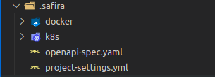
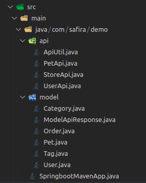

# Gerando Projeto Spring-boot

### Detalhes práticos duranto a geração do projeto Springboot


 -  Would you like to use inso (insomnia) spec? - Caso queira utilizar insomnia como base. (Caso não optar pela geração do projeto através do insomnia, deverá escrever o caminho do arquivo .yaml ou json)

 - The path to the Openapi file: caso não opte por usar a spec do insomnia, o caminho para o arquivopara uma especificação do openapi deverá ser fornecida.

 - The path to insomnia v4 or Insomnia workspace? - Caso opte por usar a especificação do insomnia  o caminho para o workspace ou caminho do arquivo insomnia v4 deverá ser fornecido. 

 - The name of the spec of the spec in the workspace? - Escreva o nome da spec que deseja utilizar.

 -  The description of the new project? - Escreva a descrição do projeto (Opcional)

 - Aplication port? - Escreva qual porta deseja utilizar.

 - Generat Kong for Kubernetes configuration? - Opção caso desejar gerar as configurações para o Kong.

 - Framework to use? - Opção de qual framewok desejar utilizar (primeira versão: Springboot ou Quarkus)

 - Java version to use? - Opção de qual versão está utilizando.

 - Java package? - Pacote padrão do projeto Java.

 - Docker registry? - Endpoint para o registry que deseja publicar as image Docker.

 - Kubernetes namespace? - Escreva o nome do Kubernetes (Opcional).

## Detalhes dos artefatos gerados após a criação do projeto JAVA

- Spring Boot
### Artefatos
Detalhes do projeto gerado em Springboot:


:::caution Importante versionar essa pasta.Não adicionar no .gitignore 
:::
- A pasta .safira:
 -  docker: Pasta onde estará presente o Dockerfile do projeto

 - k8s: Pasta onde estão os arquivos do kubernetes.

 -  openapi-spec.yaml: Uma cópia da especificação openapi utilizada para a geração do projeto, quando utilizado o insomnia, é extraído a especificação e armazenada.

 -  project-settings.yml: No arquivo fica todas as configurações relacionadas ao projeto para serem utilizadas pelo safira-cli.



- docker:
  - Por padrão apenas um Dockerfile é criado, mas também é possível criar mais e Dockerfiles.


- kubernetes:
  - confimap.yaml: é feita uma cópia do application.properties

  - deployment.yaml: arquivo de deployment do kubernetes

  - namespace.yaml: arquivo para criação do namespace.

  - service.yaml: configurações do kubernetes para a service da aplicação.


- Stubs gerados e models:
  - api: Todas as apis geradas a partir da especificação estarão descritas aqui.
  - model: Os models utilizados nas apis estarão aqui.




- Classes de testes geradas:

  -  Para cada interface será criada uma classe de teste. 


  - Exemplo da classe de teste:

```yaml
package com.safira.demo.api;

import io.quarkus.test.junit.QuarkusTest;
import org.junit.jupiter.api.Test;

@QuarkusTest
public class PetApiTest {

  @Test
  public void test() {}
}

```
- Okteto template:

```yaml
name: mvn-quarkus-end-app
image: okteto/maven:3
command: bash
volumes:
- /root/.m2
sync:
  - .:/usr/src/app
autocreate: true
forward:
  - 8080:8080
  - 5005:5005

```